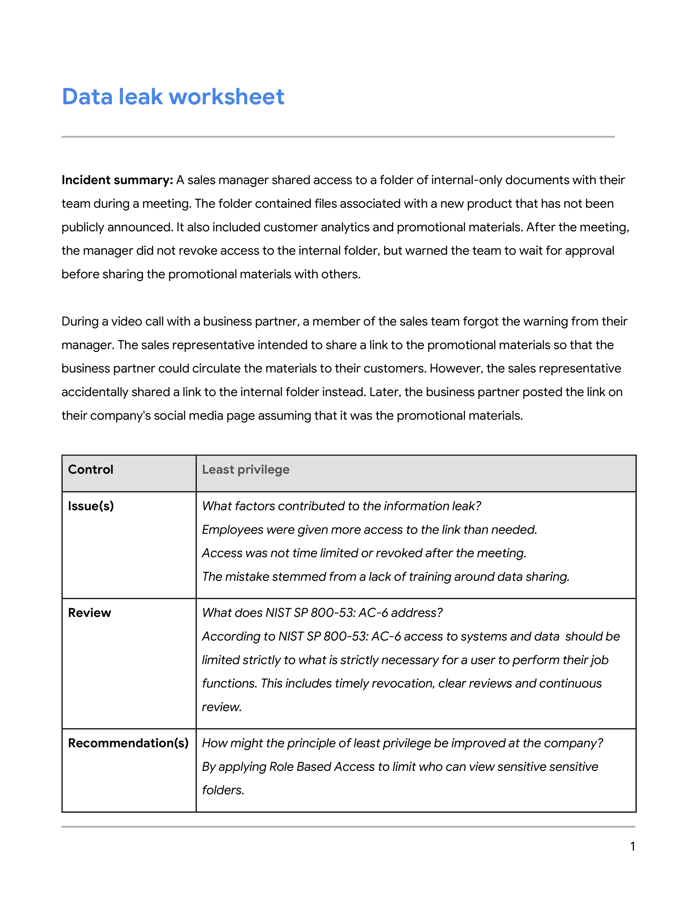
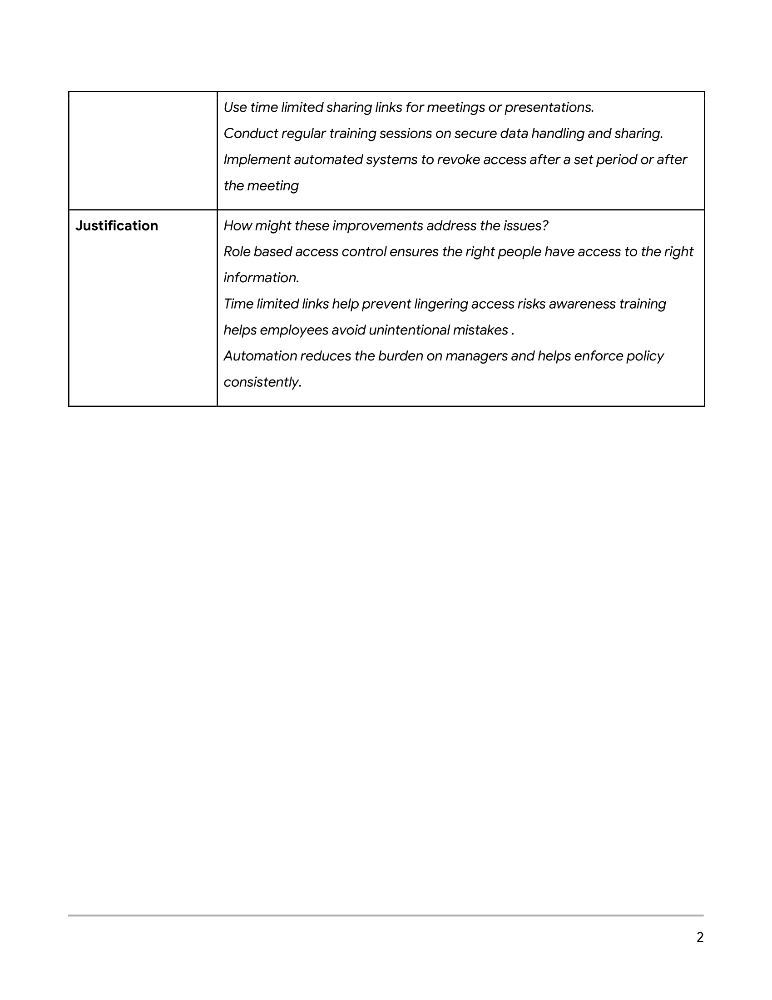
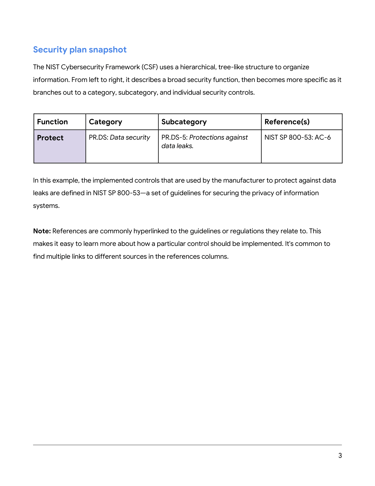
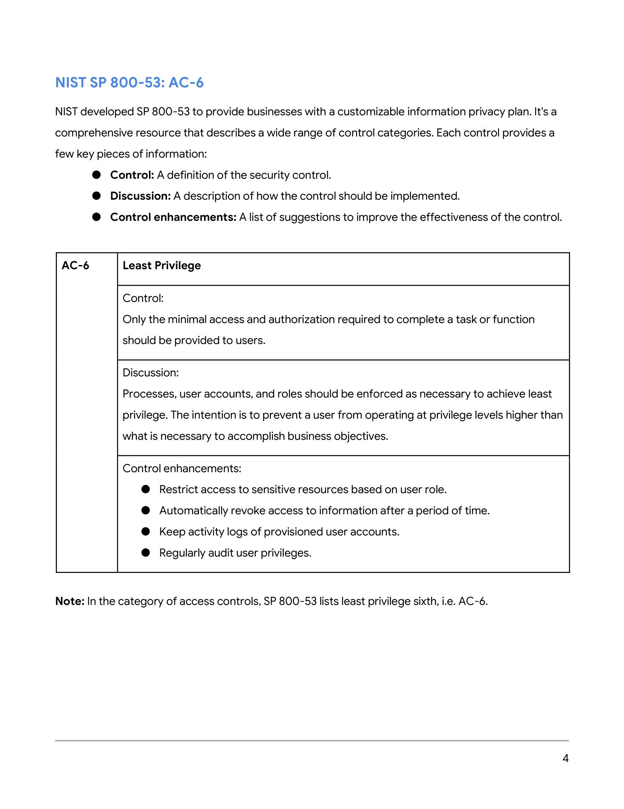

# Determining-appropriate-data-handling-practices
I will review a data risk assessment report to evaluate whether current data handling procedures effectively protect information privacy
## Scenario

## 

Review the following scenario. Then complete the step-by-step instructions.

You work for an educational technology company that developed an application to help teachers automatically grade assignments. The application handles a wide range of data that it collects from academic institutions, instructors, parents, and students.

Your team was alerted to a data leak of internal business plans on social media. An investigation by the team discovered that an employee accidentally shared those confidential documents with an external business partner. An audit into the leak is underway to determine how similar incidents can be avoided.

A supervisor provided you with information regarding the leak. It appears that the principle of least privilege was not observed by employees at the company during a sales meeting. You have been asked to analyze the situation and find ways to prevent it from happening again.

First, you'll need to evaluate details about the incident. Then, you'll review the controls in place to prevent data leaks. Next, you'll identify ways to improve information privacy at the company. Finally, you'll justify why you think your recommendations will make data handling at the company more secure.

